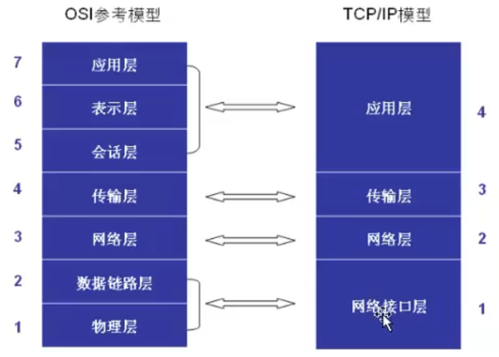
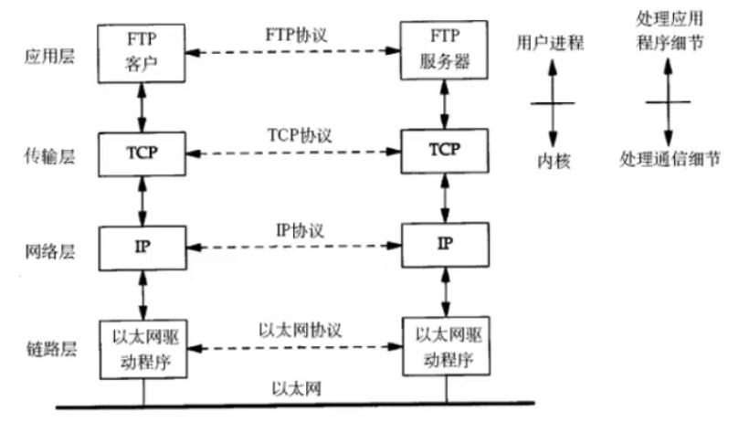
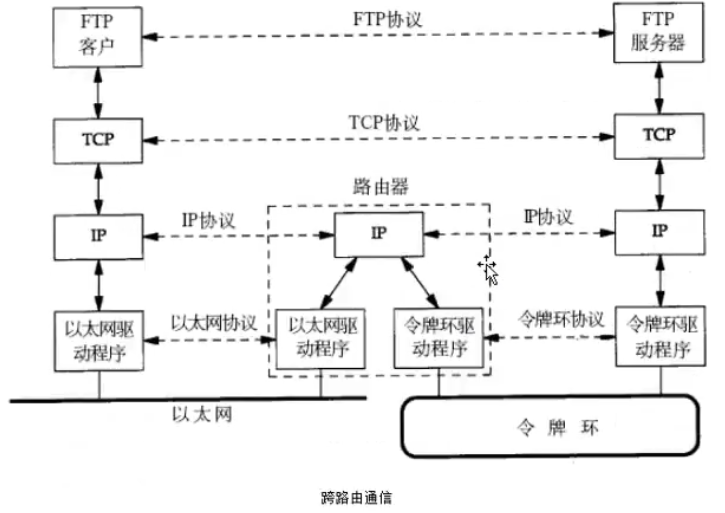
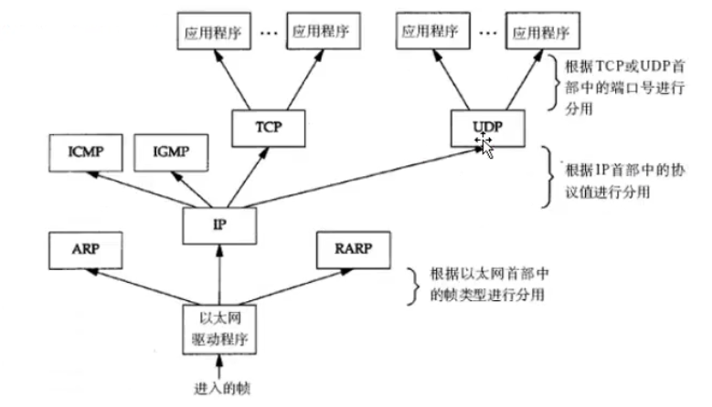
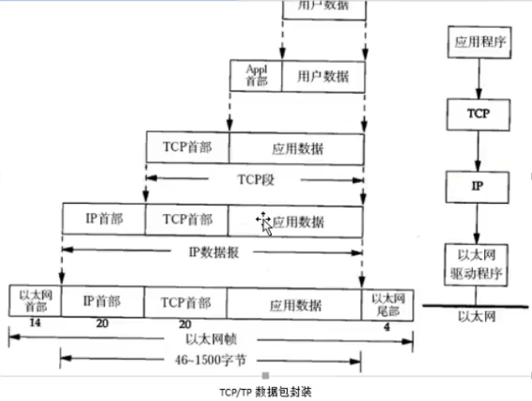
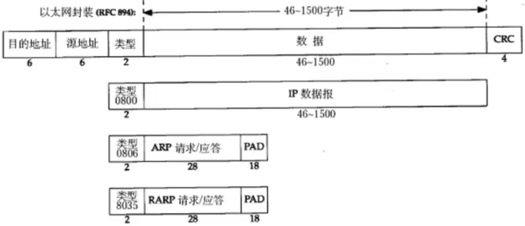
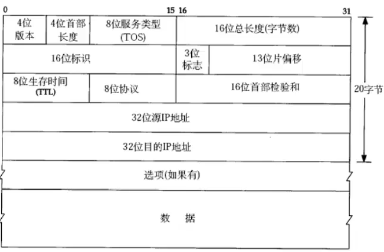

[TOC]

# 1. 协议的概念
## 1.1 什么是协议
从应用的角度出发，协议可以理解为"规则"，是数据传输和数据的解释的规则。

假设，A、B双方欲传输文件，规定：

第一次：传输文件名，接收方接收到文件名应答 OK 给传输方；

第二次：发送文件的尺寸，接收方接收到该数据再次应答一个 OK；

第三次：传输文件内容。同样，接收方接收数据完成后应答 OK 表示文件内容接收成功。

由此，无论 A, B 之间传递何种文件，都是通过三次数据传输来完成。A, B 之间形成了一个最简单的数据传输规则。双方都按此规则发送、接收数据。A, B 之间达成的这个相互遵守的规则即为协议。

这种仅在 A, B 之间被遵守的协议称为`原始协议`。当此协议被更多人采用，不断增加、改进、维护、完善。最终形成一个稳定的、完整的文件传输协议，被广泛应用于各种文件传输过程中。该协议就成为一个`标准协议`。最早的 ftp 协议就是由此衍生而来。

TCP 协议注重数据的传输，http 协议注重于数据的解释。

## 1.2 典型协议
传输层：常见协议有 TCP/UDP 协议；

应用层：常见的协议有 HTTP 协议，FTP 协议；

网络层：常见的协议有 IP 协议、ICMP 协议、IGMP 协议；

网络接口层：常见的协议有 ARP 协议、RARP 协议。

TCP 传输控制协议(Transmission Control Protocol)是一种面向连接的、可靠的、基于字节流的传输层通信协议。

UDP 用户数据报协议(User Datagram Protocol)是 OSI 参考模型中一种无连接的传输层协议，提供面向事务的简单不可靠信息传送服务。

HTTP 超文本传输协议(Hyper Text Transfer Protocol)是互联网上应用最为广泛的一种网络协议。

FTP 文件传输协议(File Transfer Protocol)

IP 协议是因特网互联协议(Internet Protocol)

ICMP 协议是 Internet 控制报文协议(Internet Control Message Protocol)它是 TCP/IP 协议族的一个子协议，用于在 IP 主机、路由器之间传递控制消息。

IGMP 协议是 Internet 组管理协议(Internet Group Management Protocol)，是因特网协议家族中的一个组播协议。该协议运行在主机和组播路由器之间。

ARP 协议是正向地址解析协议(Address Resolution Protocol)，通过已知的 IP，寻找对应主机的 MAC 地址。

RARP 是反向地址转换协议，通过 MAC 地址确定 IP 地址。

# 2. 网络应用程序设计模式
## 2.1 C/S 模式
传统的网络应用设计模式，客户机(client)/服务器(server)模式。需要在通讯两端各自部署客户机和服务器来完成数据通信。

## 2.2 B/S 模式
浏览器/服务器模式。只需要在一端部署服务器，而另一端使用第台 PC 都默认配置的浏览器即可完成数据的传输。

## 2.3 优缺点
对于 C/S 模式来说，其优点明显。客户端位于目标主机上可以保证性能，将数据缓存至客户端本地，从而提高数据传输效率。且一般来说，客户端和服务器程序由一个开发团队完成，所以他们之间所采用的协议相对灵活。可以在标准协议的基础上根据需求裁剪及定制。例如，腾讯公司所采用的通信协议，即为 tfp 协议的修改裁剪版。

因此，传统的网络应用程序及较大型的网络应用程序都首选 C/S 模式进行开发。如，知名的网络游戏魔兽世界。3D 画面，数据量庞大，使用 C/S 模式可以提前在本地进行大量数据的缓存处理，从而提高观感。

C/S 模式的缺点也较突出。由于客户端和服务器都需要有一个开发团队来完成开发，工作量将成倍提升，开发周期较长。另外，从用户角度出发，需要将客户端安插至用于主机上，对用户主机的安全性构成威胁。这也是很多用户不愿意使用 C/S 模式应用程序的重要原因。

B/S 模式相比 C/S 模式而言，由于它没有独立的客户端，使用标准浏览器作为客户端，其开发工作量较小，只需要开发服务器端即可。另外由于采用浏览器显示数据，因此移植性非常好，不受平台限制。如早期的偷菜游戏，在各个平台上都可以完美运行。

B/S 模式的缺点也较明显。由于使用第三方浏览器，因此网络应用支持受限。另外，没有客户端放到对方主机上，缓存数据不尽如人意，从而传输数据量受到限制，应用的观感大打折扣。第三，必须与浏览器一样，采用标准 http 协议进行通信，协议选择不灵活。

# 3. 分层模型
## 3.1 OSI 七层模型

**物理层**：主要定义物理设备标准，如网线的接口类型、光纤的接口类型、各种传输介质的传输速率等。它的主要作用是传输比特流(就是由 0，1 转化为电流强弱来进行传输，到达目的地后再转化为1，0，也就是我们常说的数模转换与模数转换)，这一层的数据叫做比特。

**数据链路层**：定义了如何让格式化数据以帧为单位进行传输，以及如何让控制对物理介质的访问。这一层通常还提供错误检测和纠正，以确保数据的可靠传输。如串口通信中使用到的 115200、8、N、1。

**网络层**：在位于不同地理位置的网络中的两个主机系统之间提供连接和路径选择。Internet 的发展使得从世界各站点访问信息的用户数大大增加，而网络层正是管理这种连接的层。

**传输层**：定义了一些传输数据的协议和端口号(WWW端口80等)，如：TCP(传输控制协议，传输效率低，可靠性强，用于传输可靠性要求高，数据量大的数据)，UDP(用户数据报协议，与TCP特性恰恰相反，用于传输可靠性要求不高，数据量小的数据，如QQ聊天数据就是通过这种方式传输的)。主要是将从下层接收到的数据进行分段和传输，到达目的地址后再进行重组。常常把这一层数据叫做段。

**会话层**：通过传输层(端口号：传输端口与接收端口)建立数据传输的通路。主要在你的系统之间发起会话或者接受会话请求(设备之间需要互相认识可以是IP也可以是MAC或者是主机名)。

**表示层**：可确保一个系统的应用层所发送的信息可以被另一个系统的应用层读取。例如，PC程序与另一台计算机进行通信，其中一台计算机使用扩展二一十进制交换码(EBCDIC)，而另一台则使用美国信息交换标准码(ASCII)来表示相同的字符。如有必要，表示层会通过使用一种通用格式来实现多种数据格式之间的转换。

**应用层**：是最靠近用户的OSI层。这一层为用户的应用程序(使用如电子邮件、文件传输和终端仿真)提供网络服务。

## 3.2 TCP/IP 四层模型

一般在应用开发过程中，讨论最多的是 TCP/IP 模型。

# 4. 通信过程
两台计算机通过 TCP/IP 协议通讯的过程如下所示：

上图对应两台计算机在同一网段中的情况，如果两台计算机在不同的网段中，那么数据从一台计算机到另一台计算机传输过程中要经过一个或多个路由器，如下图所示：

链路层有以太网、令牌环网等标准，链路层负责网卡设备的驱动、帧同步(即从网线上检测到什么信号算作新帧的开始)、冲突检测(如果检测到冲突就自动重发)、数据差错检验等工作。交换机是工作在链路层的网络设备，可以在不同的链路层网络之间转发数据帧(比如十兆以太网和百兆以太网之间、以太网和令牌环网之间)，由于不同链路层的帧格式不同，交换机要将进来的数据包拆掉链路层首部重新封装之后再转发。

网络层的 IP 协议是构成 Internet 的基础。Internet 上的主机通过 IP 地址来标识，Internet 上有大量路由器负责根据 IP 地址选择合适的路径转发数据包，数据包从 Internet 上的源主机到目的主机往往要经过十多个路由器。路由器是工作在第三层的网络设备，同时兼有交换机的功能，可以在不同的链路层接口之间转发数据包，因此路由器需要将进来的数据包拆掉网络层和链路层两层首部并重新封装。IP 协议不保证传输的可靠性，数据包在传输过程中可能丢失，可靠性可以在上层协议或应用程序中提供支持。

网络层负责点到点的传输(这里的"点"指主机或路由器)，而传输层负责端到端的传输(这里的"端"指源主机和目的主机)。传输层可选择TCP或UDP协议。

TCP 是一种面向连接的、可靠的协议，有点像打电话，双方拿起电话互通身份之后就建立了连接，然后说话就行了，这边说的话那边保证听得到，并且是按说话的顺序听到的，说完话挂机断开连接。也就是说 TCP 传输的双方需要首先建立连接，之后由 TCP 协议保证数据收发的可靠性，丢失的数据包自动重发，上层应用程序收到的总是可靠的数据流，通讯之后关闭连接。

UDP 是无连接的传输协议，不保证可靠性，有点像寄信，信写好放到邮箱里，既不能保证信件在邮递过程中不会丢失，也不能保证信件寄送顺序。使用 UDP 协议的应用程序需要自己完成丢包重发、消息排序等工作。

目的主机收到数据包后，如何经过各层协议栈最后到达应用程序呢？其过程如下图所示：

以太网驱动程序首先根据以太网首部中的"上层协议"字段确定该数据帧的有效载荷...

# 5 协议格式
## 5.1 数据包封装

不同的协议层对数据包有不同的称谓，在传输层叫做段(segment)，在网络层叫做数据报(datagram)，在链路层叫做帧(frame)。数据封装成帧后发到传输介质上，到达目的主机后每层协议再剥掉相应的首部，最后将应用层数据交给应用程序处理。

## 5.2 以太网帧格式
以太网的帧格式如下所示：

其中的源地址和目的地址是指网卡的硬件地址(也叫MAC地址)，长度是48位，是在网卡出厂时固化的，可在shell中使用`ifconfig`命令查看。协议字段有三种值，分别对应 IP、ARP、RARP。帧尾是 CRC 检验码。

## 5.3 ARP 数据报格式
在网络通讯时，源主机的应用程序知道目的主机的 IP 地址和端口号，却不知道目的主机的硬件地址，而数据包首先是被网卡接收到再去处理上层协议的，如果接收到的数据包的硬件地址与本机不符，则直接丢弃。因此在通讯前必须获得目的主机的硬件地址。ARP 协议就起到这个作用。源主机发出 ARP 请求，询问 "IP 地址是 192.168.0.1 的主机的硬件地址是多少"，并将这个请求广播到本地网段(以太网帧首部的硬件地址填 FF:FF:FF:FF:FF:FF 表示广播)，目的主机接收到广播的 ARP 请求，发现其中的 IP 地址与本机相符，则发送一个 ARP 应答数据包给源主机，将自己的硬件地址填写在应答包中。

每台主机都维护一个 ARP 缓存表，可以用 `arp -a` 命令查看。缓存表中的表项有过期时间(一般为20min)，如果20min内没有再次使用某个表项，则该表项失效，下次还要发 ARP 请求来获取目的主机的硬件地址。想一想，为什么表项要有过期时间而不是一直有效？

ARP 数据报的格式如下所示：

源 MAC 地址、目的 MAC 地址在以太网首部和 ARP 请求中各出现一次，对于链路层为以太网的情况是多余的，但如果链路层是其它类型的网络则有可能是必要的。硬件类型指链路层网络类型，1为以太网，协议类型指要转换的地址类型，0x0800为IP地址，后面两个地址长度对于以太网地址和 IP 地址分别为6和4(字节)，op字段为1表示 ARP 请求，op字段为2表示 ARP 应答。

## 5.4 IP 段格式

IP 数据报的首部长度和数据长度都是可变长的，但总是4字节的整数倍。对于 IPV4，4位版本字段是4。4位首部长度的数值是以4字节为单位的，最小值为5，也就是首部长度最小是4*5=20字节，也就是不带任何数据的 IP 首部，4位能表示的最大值是15，也就是说首部长度最大是60字节。8位TOS字段有3个位用来指定IP数据报的优先级(目前已经废弃不用)，还有4个位表示可选的服务类型(最小延迟、最大吞吐量、最大可靠性、最小成本)，还有一个位总是0。总长度是整个数据报(包括IP首部和IP层payload)的字节数。每传一个IP数据报，16位的标识加1，可用于分片和重新组装数据报。3位标志和13位片偏移用于分片。TTL(time to live)是这样用的：源主机为数据包设定一个生存时间，比如64，每过一个路由器就把该值减1，如果减到0就表示路由已经太长了仍然找不到目的主机的网络，就丢弃该包，因此这个生存时间的单位不是秒，而是跳(hop)。协议字段指示上层协议是TCP、UDP、ICMP 还是 IGMP。然后是校验和，只校验IP首部，数据的校验由更高层协议负责。IPV4的IP地址长度为32位。

想一想，前面讲了以太网帧中最小数据长度为46字节，不足46字节的要用字节补上，那么如何界定这46字节里前多少个字节是IP、ARP或RARP数据报而后面是填充字节？

## 5.5 UDP 数据报格式 

## 5.6 TCP 数据报格式

# 6. TCP 协议

# 7. UDP 协议
